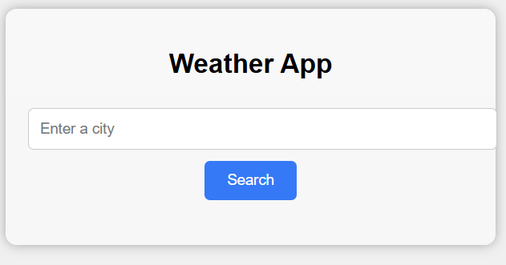
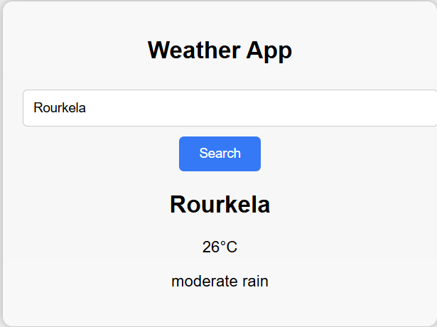

# 🌤️ Weather App

A simple weather lookup app that fetches real-time weather data for any city using the OpenWeatherMap API. Built with plain HTML/CSS/JavaScript on the frontend and a small Express.js server on the backend to keep the API key secure.


## Screenshots




## Features

- Search current weather by city name
- Press Enter or click Search to look up weather
- Displays live temperature in °C
- Shows weather description (e.g. "clear sky", "light rain")
- Basic error handling for invalid cities or API failures
- API key kept server-side (never exposed in the browser)

## Tech Stack

- **Frontend:** HTML, CSS, JavaScript (Fetch API)
- **Backend:** Node.js + Express
- **Data:** [OpenWeatherMap API](https://openweathermap.org/api)

## Project Structure
weather-app/
├── server.js # Express backend — keeps API key secret, proxies requests
├── index.html # Page markup
├── style.css # Styling
├── script.js # Frontend logic — DOM updates and fetch calls
├── screenshots/ # App preview images used in this README
├── .env # Your API key (not committed to GitHub)
└── README.md
weather-app/
├── server.js # Express backend — keeps API key secret, proxies requests
├── index.html # Page markup
├── style.css # Styling
├── script.js # Frontend logic — DOM updates and fetch calls
├── screenshots/ # App preview images used in this README
├── .env # Your API key (not committed to GitHub)
└── README.md
## Getting Started (Run Locally)

### Prerequisites
- [Node.js](https://nodejs.org) installed
- A free API key from [OpenWeatherMap](https://openweathermap.org/api)

### Setup

1. Clone the repository
```bash
git clone https://github.com/dasaridevi123/weather-app.git
cd weather-app
```

2. Install dependencies
```bash
npm install express dotenv
```

3. Create a `.env` file in the project root
OPENWEATHER_API_KEY=your_actual_key_here


4. Run the server
```bash
node server.js
```

5. Open your browser and go to

http://localhost:3000


## Usage

1. Type a city name (e.g. `Rourkela`, `London`, `Tokyo`)
2. Press **Enter** or click **Search**
3. View the city name, temperature, and weather description

## Ideas for Improvement

- Add a loading state during fetch
- Add a 5-day forecast view
- Support °C / °F toggle
- Add weather icons based on condition

## Author

Built by **Dasari Devi** — [GitHub](https://github.com/dasaridevi123) · [LinkedIn](https://www.linkedin.com/in/devi-dasari-ab2729374/)